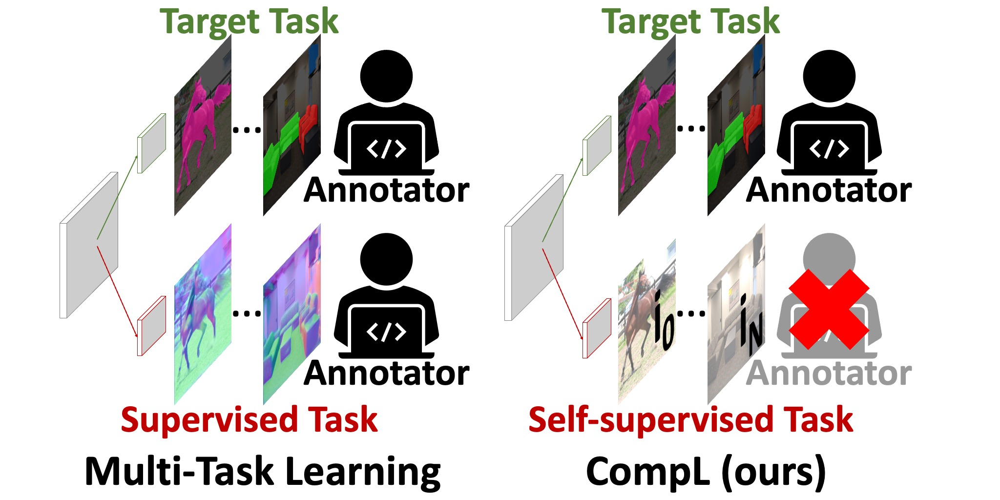

# Composite Learning for Robust and Effective Dense Predictions

This is the official repository of [CompL](https://arxiv.org/abs/2210.07239).
In CompL, we investigate and find that jointly training a dense prediction (target) task with a self-supervised 
(auxiliary) task can consistently improve the performance of the target task, while eliminating the need for labeling 
auxiliary tasks. 
We also find that CompL can improve model robustness when the models are evaluated in new domains.

<p align="center">

</p>

## Installation / Setup

This codebase makes use of Docker for easy reproducibility.

### Clone the repository
```
git clone https://github.com/menelaoskanakis/CompL.git
```

### Build Dockerfile
```
cd CompL
docker build -t compl:latest .
```

### Define WANDB key

You need to specify the WANDB key and project_name in vissl/engines/train.py

## Datasets

```
CompL
├── Already existing directories
└── data
    ├── NYUD_MT 
    ├── VOC
    │    └── VOCdevkit
    │        └── VOCdevkit
    │           └── VOC2012 
    └── mini_val_imagenet
```
You can find the NYUD_MT dataset [here](https://data.vision.ee.ethz.ch/kanakism/NYUD_MT.zip). 
For this project we also used the augmented VOC split for semantic segmentation. You can find more info [here](https://www.sun11.me/blog/2018/how-to-use-10582-trainaug-images-on-DeeplabV3-code/)

## Training

To optimize a network you can just run

```
python run_distributed_engines.py config=relative/path/to/config

e.g.
python run_distributed_engines.py config=CompL/SemsegDenseCL_deeplab26GN
```
The configs can be found here
```
CompL
└── configs
    └── config
        ├── baselines
        └── CompL
```

## Citation

If you use this code or models, please consider citing our paper:

```
@inproceedings{kanakis2023composite,
  title={Composite Learning for Robust and Effective Dense Predictions},
  author={Kanakis, Menelaos and Huang, Thomas E and Br{\"u}ggemann, David and Yu, Fisher and Van Gool, Luc},
  booktitle={Proceedings of the IEEE/CVF Winter Conference on Applications of Computer Vision},
  pages={2299--2308},
  year={2023}
}
```

## Acknoledgements

This demo is build on top of [VISSL](https://github.com/facebookresearch/vissl)
